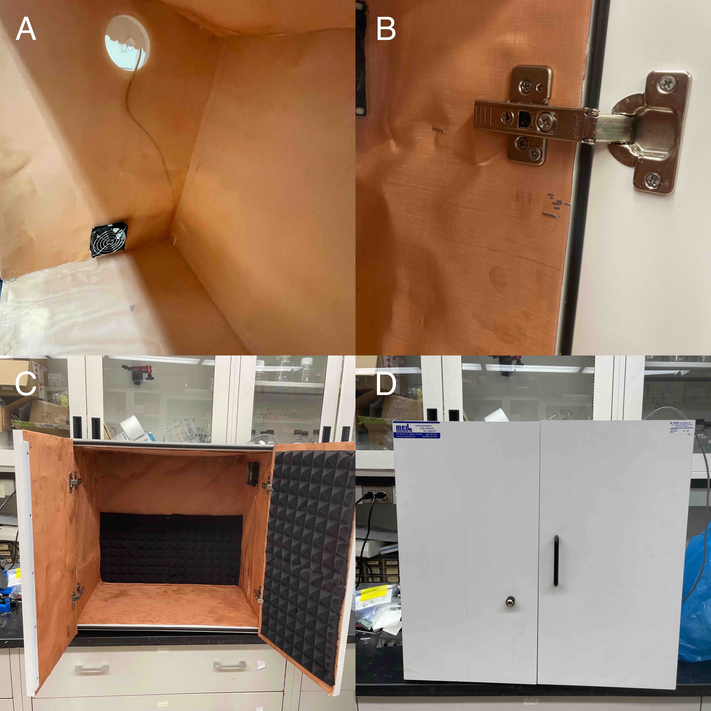
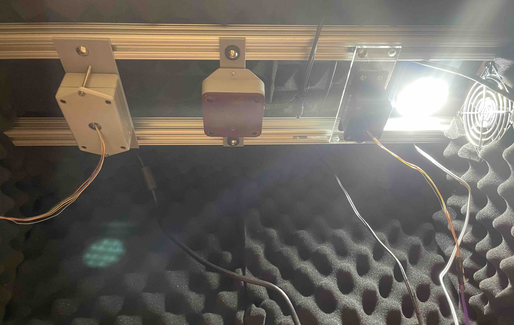
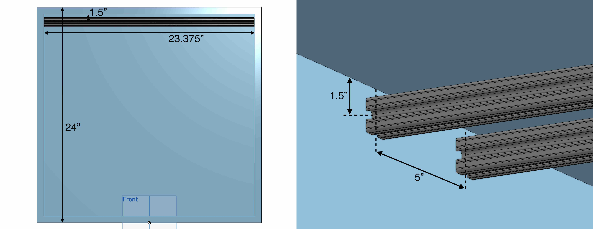
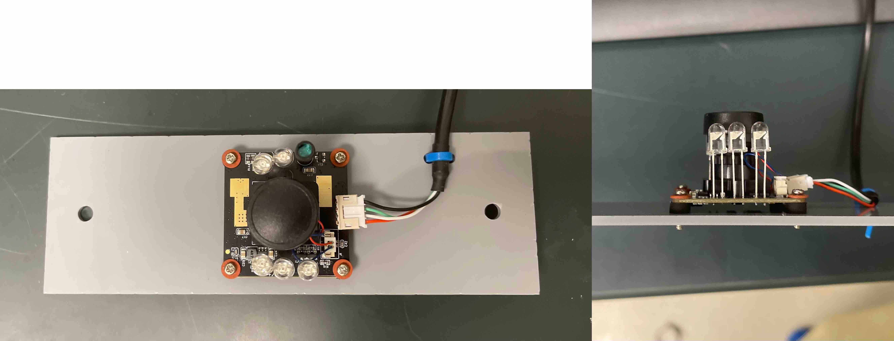
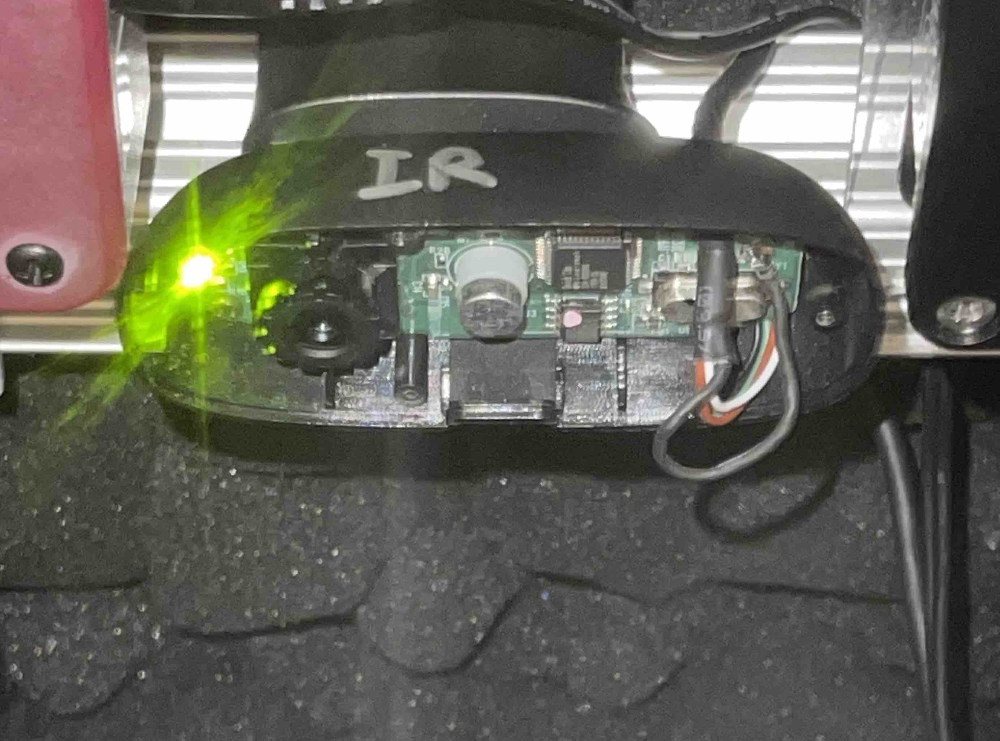
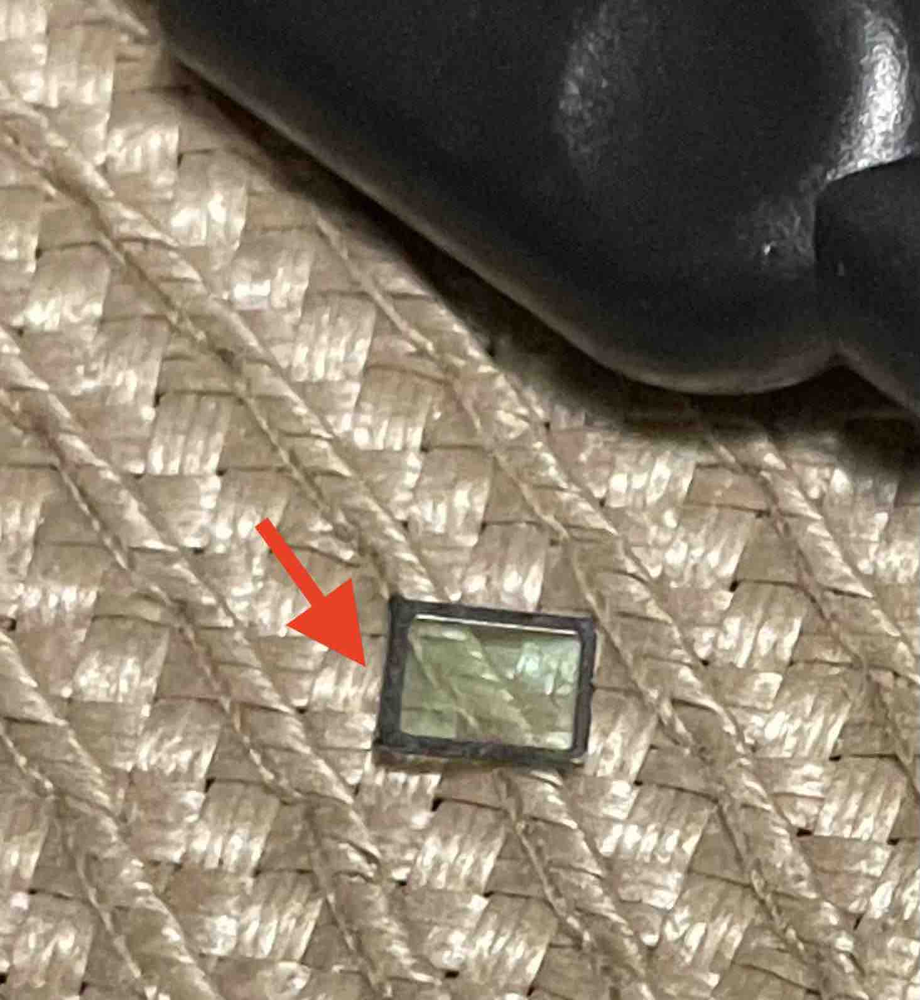
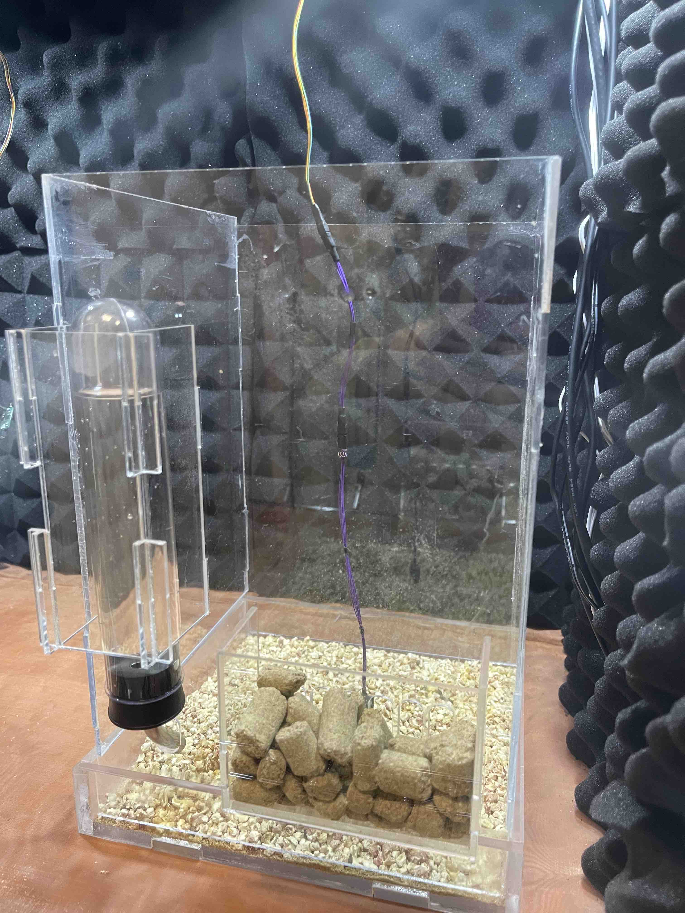
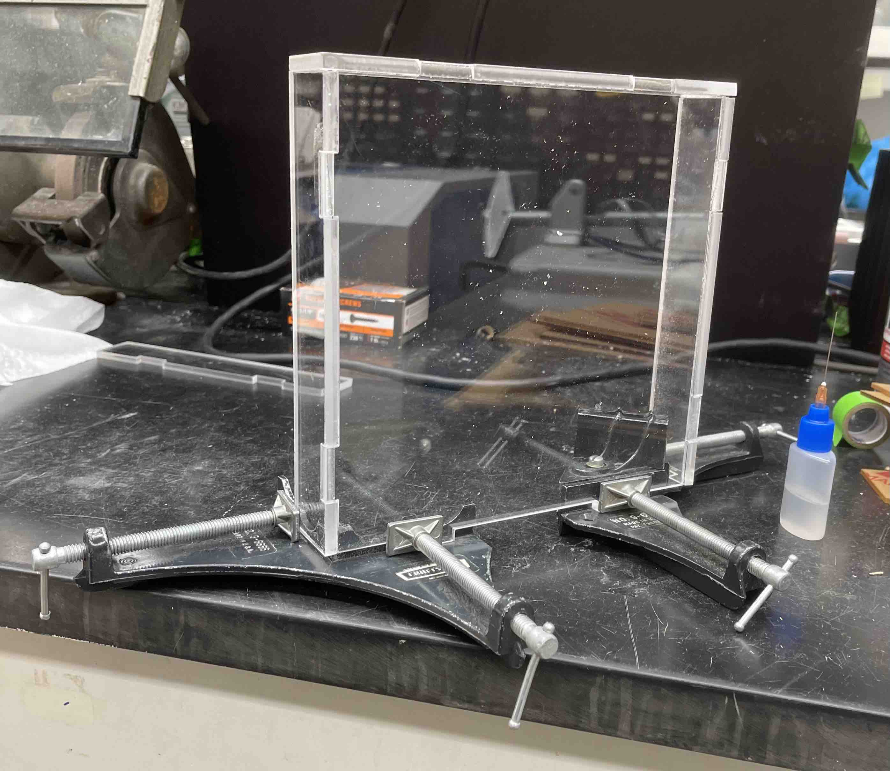
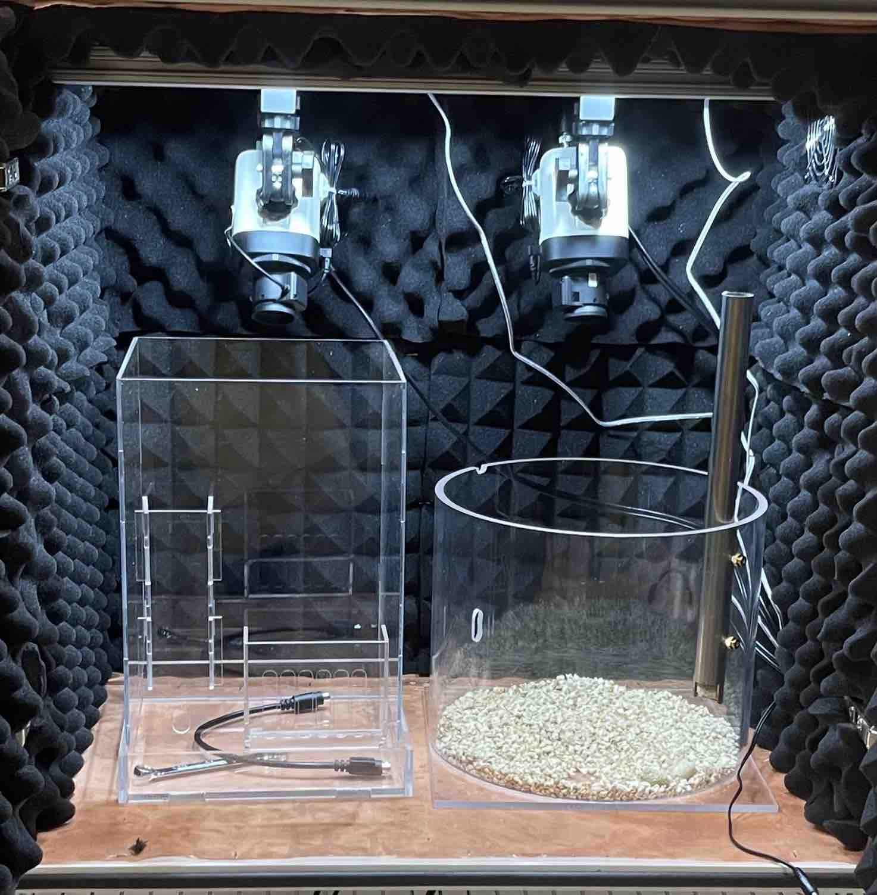

# Hardware 

## Hardware requirements

- Pinnacle Data Conditioning and Acquisition System(s)
- Pinnacle EEG/EMG headmounts
- Modified Med Associates Sound Attenuating Cubicle
- Recording enclosure
- Camera(s)
- Desktop/laptop

For a comprehensive list of hardware materials used in the build, please
click [here](./BOM.md).

For the laser-cut files and drawings, please click [here](./Laser%20cut%20parts/).

## Setup guide
1. [Faraday-shielding and sound-proofing](#faraday-shielding-and-sound-proofing)
2. [Aluminum framing](#aluminum-framing)
3. [Pinnacle System, lighting, & ventilation](#pinnacle-system-lighting--ventilation)
4. [Camera setup](#camera-setup)
5. [Recording enclosure](#recording-enclosure)

-----

## Faraday-shielding and sound-proofing

This portion of the guide explains the Faraday-shielding and sound-proofing of
the Med Associates box, which reduces external electromagnetic fields and noise.
This will serve as a controlled environment for the EEG/EMG recordings to take
place.

 
**Figure 1.** _Sequential application of copper mesh and acoustic foam panels._ (A & B)
Installation of the copper mesh. (C) Installation of the acoustic foam panels.
(D) Outside view of the newly modified box.

**Materials**
- [Med Associates Sound Attenuating Box](https://med-associates.com/product/sound-attenuating-cubicles-mdf/)
- [Copper mesh](https://www.twpinc.com/100-mesh-copper-0045-wire-dia)
- [Acoustic foam panels](https://www.amazon.com/Self-Adhesive-Quick-Recovery-Elasticity-Eco-Friendly-WVOVW/dp/B0BLTSW8KC)
- Staples & staple gun
- Disinfecting wipes

**Steps**
1. Clean the inside of the Med Associates box with disinfecting wipes
2. Uninstall the doors from the hinges
3. Measure and cut the copper mesh to the dimensions of the inside box and door
   panels
4. Fix the copper mesh to the inside box surfaces with staples
5. Cut holes in the copper mesh for the box's door hinges, ventilation fan, and cable hole
6. Reinstall the screws for the door hinges through the copper mesh
7. Fix the acoustic foam panels, over the copper mesh, to the inside box
   surfaces with staples
8. Cut holes in the foam for the door hinges, ventilation fan, and cable hole

## Aluminum framing

This portion of the guide explains the installation of the aluminum
framing/railing, which is used to mount overhead equipment.

 
**Figure 2.** _Example of overhead equipment mounted to the aluminum framing._

**Materials**
- [T-slot aluminum extrusion profile
  framing 1010](https://8020.net/1010.html)
- [T-nuts](https://8020.net/search/?q=t-nut)
- 1/4" screws
- Drill

**Steps**
1. Install two aluminum railings (23 3/8" long) that are positioned 1.5" from
   the ceiling and 5" apart using 1/4" screws and a drill
    * Using a blade, carefully remove the acoustic foam from the inside wall of
      the box with accordance to the width of the aluminum
      railing
2. After installing the railings, slide in T-nuts to the railing's T-slots to
   your liking, which can be used to fix overhead attachments

 
**Figure 3.** _Drawing of aluminum framing inside Med Associates box._

## Pinnacle System, lighting, & ventilation

This portion of the guide explains how to setup the Pinnacle System, circadian
lighting, and ventilation. This is the key hardware of the EEG/EMG recording setup.

**Materials**
- Pinnacle Data Conditioning and Acquisition System(s) (Models
  [8401](https://store.pinnaclet.com/products/8401-hr-4-channel-data-conditioning-and-acquisition)
  &
  [8206](https://store.pinnaclet.com/products/8206-data-conditioning-and-acquisition-system)
  used)
- Amplifier-to-commutator extension cables ([8401
  extension](https://www.amazon.com/Copartner-E119932-T-20276-15-Pin-Monitor/dp/B00MSE7Y3W/)
  & [8206
  extension](https://www.amazon.com/Shielded-Cable-Black-Mouse-Keyboard/dp/B0933GL5CX/)
  used)
- [LED
  lights](https://www.amazon.com/JUSJUBR-Lighting-Dimmable-Function-Bookshelf/dp/B0CCDPNYFG)
- [IR light(s)](https://store.pinnaclet.com/products/9057-illuminator)
- [LED rotary dimmer
  switch](https://www.amazon.com/TronicsPros-12V-24V-Dimmer-Switch-Controller/dp/B07MM88SB6)
- Light meter
- [24-HR programmable outlet
  timer](https://www.amazon.com/Fosmon-Programmable-Seasonal-Portable-Aquarium/dp/B07HCQKRRY)
- [24V AC-to-DC power supply](https://www.amazon.com/ALITOVE-Converter-Transformer-5-5x2-1mm-Computer/dp/B078RY7BPL)
- Custom laser-cut plate mounts (refer to [laser cut
  files](./Laser%20cut%20parts/))
- [1/8" acrylic sheets](https://www.canalplastic.com/)
- Laser cutter ([Thunder Laser Nova
  35](https://www.thunderlaserusa.com/machines/nova/) used)
- [T-nuts](https://8020.net/search/?q=t-nut) & screws

**Steps**
1. Laser-cut plate mounts for the commutators, LED lights, and IR lights using
   acrylic sheets and the laser-cut files [found
   here](./Laser%20cut%20parts/)
2. Fix the commutators, LED lights, and IR lights to the plate mounts and T-nuts
   using screws
    * Ensure the commutator is mounted directly overhead the intended spot for the recording enclosure
3. Install the amplifier-to-commutator extension cables
4. Feed the wires through the cable hole found on the side of the Med Associates
   box
5. Replace the manufacturer's LED light dimmer switch with the rotary dimmer switch
6. Place a light meter inside the closed box to dial the rotary dimmer to the
   desired LED light intensity
    * After determining the desired light intensity, mark a line on the rotary with a permanent marker
7. Connect the LED light power cable directly to a 24-HR programmable outlet timer
    * Program the timer "on" phase to be 12 hours
8. Power on the IR light and set the switch to automatic (A)
9. Connect the 24V AC-to-DC power supply to the ventilation fan

## Camera setup

This portion of the guide explains the camera modifications and setup. This will
enable the ability to record continuous video in LED- and IR-lit conditions.

We are currently using two different cameras, each of which have their own setup
instructions below.

**Materials**
- [Arducam B0205 camera](https://www.amazon.com/Arducam-Computer-Automatic-Switching-All-Day/dp/B0829HZ3Q7/)
- [Arducam plate mount](./Laser%20cut%20parts/arducam_mount)
- Logitech C270 webcam (**old model**)
- [1/8" acrylic sheets](https://www.canalplastic.com/)
- Laser cutter ([Thunder Laser Nova
  35](https://www.thunderlaserusa.com/machines/nova/) used)
- [T-nuts](https://8020.net/search/?q=t-nut) & screws
- Small plastic zip ties

### Arducam B0205 camera setup

**Steps**
1. Laser-cut the plate mount for the Arducam using acrylic sheets and the
   laser-cut file [found here](./Laser%20cut%20parts/arducam_mount)
2. Fix the camera to the plate mount and T-nuts using screws
3. Secure the usb cable to the plate using a zip tie
4. Feed the wire through the cable hole found on the side of the Med Associates
   box

<b>Figure 4.</b> <i>Arducam B0205 secured to mounting plate.</i>

### Logitech C270 webcam setup

**NOTE:** This guide is for the older models of the Logitech C270, which have a removable IR filter
cover. The newer models sold today have the IR filter integrated
with the CCD sensor, and we **DO NOT** recommend attempting to remove the IR
filter from these. Be aware that removing the IR filter from any webcam has the risk of
damaging the CCD sensor, so proceed with caution.

 
<b>Figure 5.</b> <i>Modified Logitech C270 webcam with IR filter removed.</i>

**Steps**
1. Open the webcam enclosure to access the internal circuit board
2. Remove the lens to expose the CCD sensor
3. Using a needle, carefully pry off the IR filter cover from the edge of the CCD sensor
4. Reinstall the lens, screwing it back to the optimal focal length, and secure
   it in place with a drop of super glue
    * Connect the webcam to a computer and watch a live video feed while doing
      this step to determine the optimal focus
5. Fix the webcam's screw hole in its mounting clip with a screw to a T-nut
6. Feed the wire through the cable hole found on the side of the Med Associates
   box

 
**Figure 6.** _IR filter cover from an old model of the Logitech C270 webcam._

## Recording enclosure

The recording enclosure will house the mice undergoing EEG/EMG recordings. These
enclosures should be outfitted with food and water supply compartments.

We are using recording enclosures designed by [Dr. Yueqing
Peng](https://www.pathology.columbia.edu/profile/yueqing-peng-phd). These are
made of clear-acrylic sheets that are adhered together using Weld-on #4 glue.
Please contact Dr. Peng for the laser-cut files.

 
**Figure 7.** _Recording enclosure designed by Dr. Yueqing Peng._

**Materials**
- [Rat water
  bottles](https://www.wpiinc.com/var-505432-rat-mouse-water-bottle.html)
- [1/8" & 1/4" clear-acrylic sheets](https://www.canalplastic.com/)
- [Weld-on #4
  glue](https://www.amazon.com/Weldon-Applicator-Bottle-Pint-10308/dp/B00TCUJ7A8)
- Corner clamps & lab tape
- Laser cutter ([Thunder Laser Nova
  35](https://www.thunderlaserusa.com/machines/nova/) used)

**Steps**
1. Laser-cut 1/8" & 1/4" clear-acrylic sheets
2. Use corner clamps and lab tape to hold acrylic sheets together firmly
3. Using the applicator bottle with a syringe needle tip (sold with Weld-on #4),
   hold the bottle upright and gently squeeze air out, then release this pressure while simultaneously flipping the bottle upside down
    * This will remove any air bubbles during the glue application
4. Place the needle at the bottom corner between the two acrylic sheets and
   apply a small amount of glue from the bottom to top
    * The glue will absorb between the sheets via capillary action and the
      space between the acrylic sheets will appear wet
    * Be careful to allow any excess glue on the acrylic surface to air dry, as touching the glue can
      leave a visible mark
    * Glue residue that is visible on the surface after drying can be removed with polish
      compound and a cloth
5. Wait 3-5 minutes to allow the glued acrylic sheets to harden
    * During this time, apply firm pressure to any points between the acrylic sheets that have visible air pockets
6. Remove the corner clamps and continue gluing additional acrylic sheets together
7. After 24 hours of air drying, remove any lab tape from the assembly
8. Ensure the recording enclosure is placed inside the Med Associates box
   centered directly underneath the commutator and preamplifier

 
**Figure 87.** _Using corner clamps to hold acrylic sheets
together during the glue application._

Alternatively, you can [purchase a cage from Pinnacle
Technology](https://store.pinnaclet.com/collections/cages).

 
**Figure 9.** _Side-by-side comparison of the cage designed by Dr. Yueqing Peng
(left) and Pinnacle Technology (right; Cat. [8228](https://store.pinnaclet.com/collections/cages/products/8228-mouse-cage))_