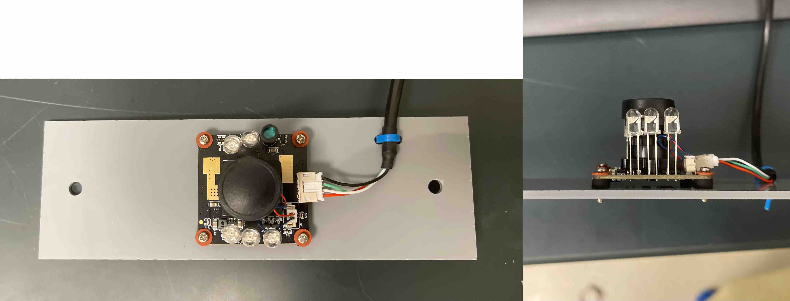
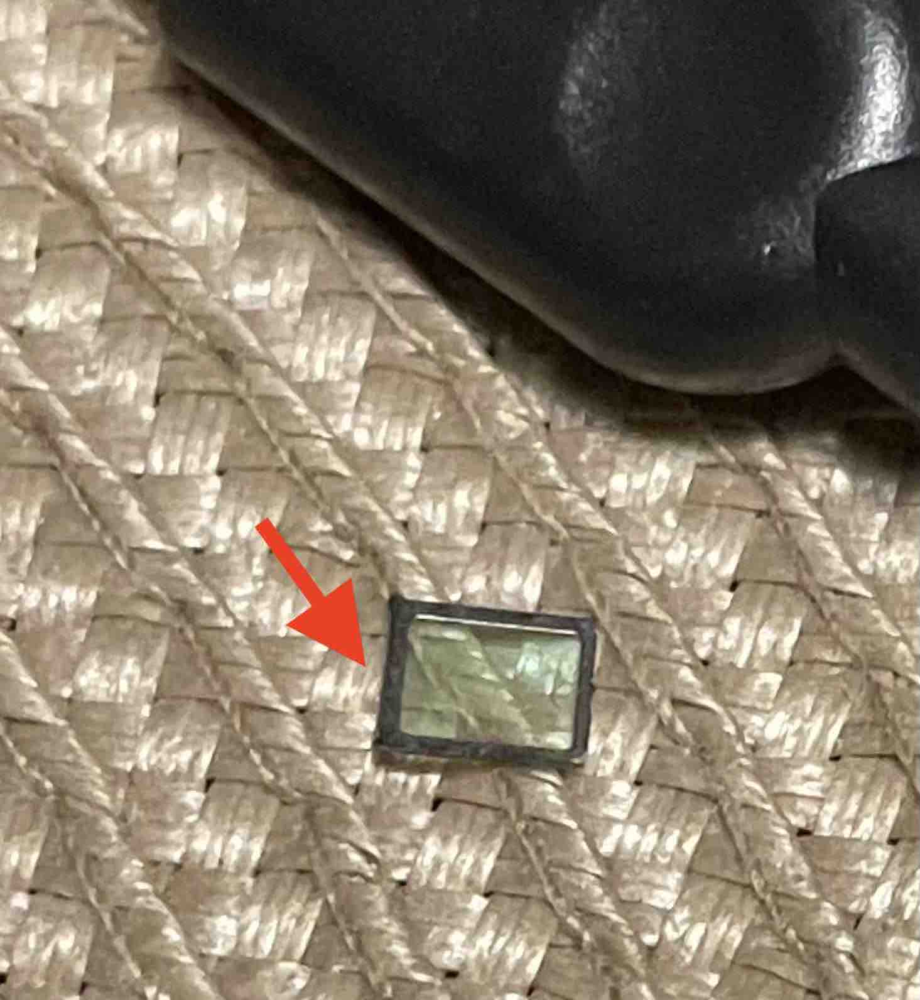

## Camera setup

This portion of the guide explains the camera modifications and setup. This will
enable the ability to record continuous video in LED- and IR-lit conditions.

We are currently using two different cameras, each of which have their own setup
instructions below.

**Materials**
- [Arducam B0205 camera](https://www.amazon.com/Arducam-Computer-Automatic-Switching-All-Day/dp/B0829HZ3Q7/)
- [Arducam plate mount](./Laser%20cut%20parts/arducam_mount)
- Logitech C270 webcam (**old model**)
- [1/8" acrylic sheets](https://www.canalplastic.com/)
- Laser cutter ([Thunder Laser Nova
  35](https://www.thunderlaserusa.com/machines/nova/) used)
- [T-nuts](https://8020.net/search/?q=t-nut) & screws
- Small plastic zip ties

### Arducam B0205 camera setup

**Steps**
1. Laser-cut the plate mount for the Arducam using acrylic sheets and the
   laser-cut file [found here](.././Laser%20cut%20parts/arducam_mount)
2. Fix the camera to the plate mount and T-nuts using screws
3. Secure the usb cable to the plate using a zip tie
4. Feed the wire through the cable hole found on the side of the Med Associates
   box

**Figure 1.** _Arducam B0205 secured to mounting plate._

### Logitech C270 webcam setup

**NOTE:** This guide is for the older models of the Logitech C270, which have a removable IR filter
cover. The newer models sold today have the IR filter integrated
with the CCD sensor, and we **DO NOT** recommend attempting to remove the IR
filter from these. Be aware that removing the IR filter from any webcam has the risk of
damaging the CCD sensor, so proceed with caution.

**Figure 2.** _Modified Logitech C270 webcam with IR filter removed._

**Steps**
1. Open the webcam enclosure to access the internal circuit board
2. Remove the lens to expose the CCD sensor
3. Using a needle, carefully pry off the IR filter cover from the edge of the CCD sensor
4. Reinstall the lens, screwing it back to the optimal focal length, and secure
   it in place with a drop of super glue
    * Connect the webcam to a computer and watch a live video feed while doing
      this step to determine the optimal focus
5. Fix the webcam's screw hole in its mounting clip with a screw to a T-nut
6. Feed the wire through the cable hole found on the side of the Med Associates
   box

**Figure 3.** _IR filter cover from an old model of the Logitech C270 webcam._