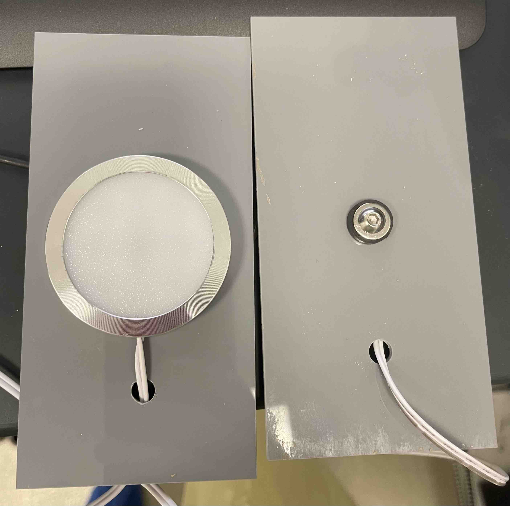
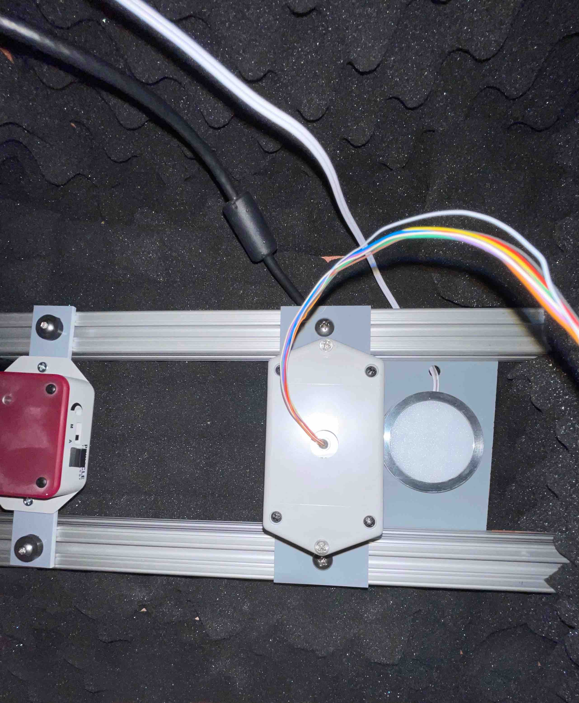

## Pinnacle System, lighting, & ventilation

This portion of the guide explains how to setup the Pinnacle System, circadian
lighting, and ventilation. This is the key hardware of the EEG/EMG recording setup.

**Materials**
- Pinnacle Data Conditioning and Acquisition System(s) (Models
  [8401](https://store.pinnaclet.com/products/8401-hr-4-channel-data-conditioning-and-acquisition)
  &
  [8206](https://store.pinnaclet.com/products/8206-data-conditioning-and-acquisition-system)
  used)
- Amplifier-to-commutator extension cables ([8401
  extension](https://www.amazon.com/Copartner-E119932-T-20276-15-Pin-Monitor/dp/B00MSE7Y3W/)
  & [8206
  extension](https://www.amazon.com/Shielded-Cable-Black-Mouse-Keyboard/dp/B0933GL5CX/)
  used)
- [LED
  lights](https://www.amazon.com/JUSJUBR-Lighting-Dimmable-Function-Bookshelf/dp/B0CCDPNYFG)
- [IR light(s)](https://store.pinnaclet.com/products/9057-illuminator)
- [LED rotary dimmer
  switch](https://www.amazon.com/TronicsPros-12V-24V-Dimmer-Switch-Controller/dp/B07MM88SB6)
- Light meter
- [24-HR programmable outlet
  timer](https://www.amazon.com/Fosmon-Programmable-Seasonal-Portable-Aquarium/dp/B07HCQKRRY)
- [24V AC-to-DC power supply](https://www.amazon.com/ALITOVE-Converter-Transformer-5-5x2-1mm-Computer/dp/B078RY7BPL)
- Custom laser-cut plate mounts (refer to [laser cut
  files](.././Laser%20cut%20parts/))
- [1/8" acrylic sheets](https://www.canalplastic.com/)
- Laser cutter ([Thunder Laser Nova
  35](https://www.thunderlaserusa.com/machines/nova/) used)
- [T-nuts](https://8020.net/3313.html) & screws

**Steps**
1. Laser-cut plate mounts for the commutators, LED lights, and IR lights using
   acrylic sheets and the laser-cut files [found
   here](.././Laser%20cut%20parts/)
2. Fix the commutators, LED lights, and IR lights to the plate mounts and T-nuts
   using screws
    * Ensure the commutator is mounted directly overhead the intended spot for
      the recording enclosure
    * Slide the LED lights, now fixed to their mounting plates, between the
      top of the aluminum framing and the ceiling
3. Install the amplifier-to-commutator extension cables
4. Feed the wires through the cable hole found on the side of the Med Associates
   box
5. Replace the manufacturer's LED light dimmer switch with the rotary dimmer switch
6. Place a light meter inside the closed box to dial the rotary dimmer to the
   desired LED light intensity
    * After determining the desired light intensity, mark a line on the rotary with a permanent marker
7. Connect the LED light power cable directly to a 24-HR programmable outlet timer
    * Program the timer "on" phase to be 12 hours
8. Power on the IR light and set the switch to automatic (A)
9. Connect the 24V AC-to-DC power supply to the ventilation fan

**Figure 1.** _LED pucks fixed to mounting plates._

**Figure 2.** _Mounting plates fixed to aluminum framing._

[← Return to setup guide](../readme.md#setup-guide)