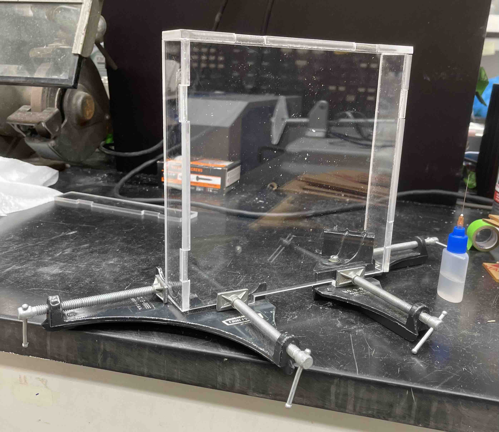
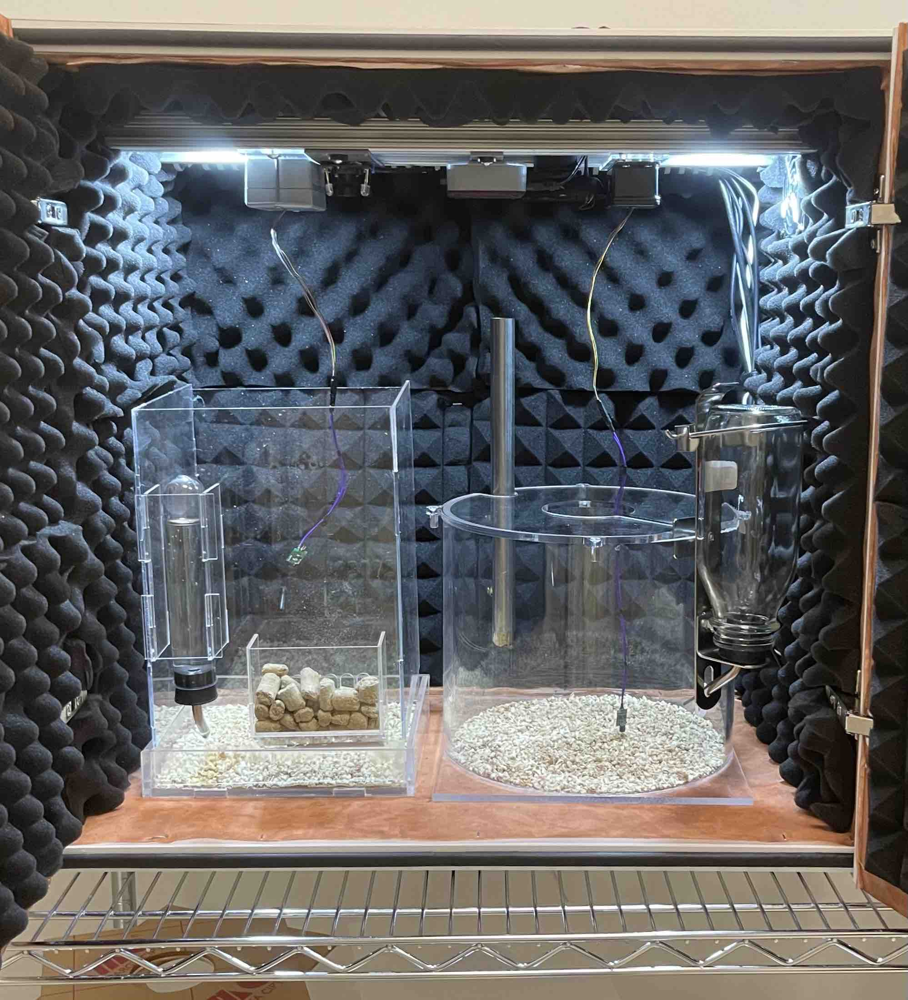

## Recording enclosure

The recording enclosure will house the mice undergoing EEG/EMG recordings. These
enclosures should be outfitted with food and water supply compartments.

We are using recording enclosures designed by [Dr. Yueqing
Peng](https://www.pathology.columbia.edu/profile/yueqing-peng-phd). These are
made of clear-acrylic sheets that are adhered together using Weld-on #4 glue.
Please contact Dr. Peng for the laser-cut files.

**Figure 1.** _Recording enclosure designed by Dr. Yueqing Peng._

**Materials**
- [Rat water
  bottles](https://www.wpiinc.com/var-505432-rat-mouse-water-bottle.html)
- [1/8" & 1/4" clear-acrylic sheets](https://www.canalplastic.com/)
- [Weld-on #4
  glue](https://www.amazon.com/Weldon-Applicator-Bottle-Pint-10308/dp/B00TCUJ7A8)
- Corner clamps & lab tape
- Laser cutter ([Thunder Laser Nova
  35](https://www.thunderlaserusa.com/machines/nova/) used)

**Steps**
1. Laser-cut 1/8" & 1/4" clear-acrylic sheets
2. Use corner clamps and lab tape to hold acrylic sheets together firmly
3. Using the applicator bottle with a syringe needle tip (sold with Weld-on #4),
   hold the bottle upright and gently squeeze air out, then release this pressure while simultaneously flipping the bottle upside down
    * This will remove any air bubbles during the glue application
4. Place the needle at the bottom corner between the two acrylic sheets and
   apply a small amount of glue from the bottom to top
    * The glue will absorb between the sheets via capillary action and the
      space between the acrylic sheets will appear wet
    * Be careful to allow any excess glue on the acrylic surface to air dry, as touching the glue can
      leave a visible mark
    * Glue residue that is visible on the surface after drying can be removed with polish
      compound and a cloth
5. Wait 3-5 minutes to allow the glued acrylic sheets to harden
    * During this time, apply firm pressure to any points between the acrylic sheets that have visible air pockets
6. Remove the corner clamps and continue gluing additional acrylic sheets together
7. After 24 hours of air drying, remove any lab tape from the assembly
8. Ensure the recording enclosure is placed inside the Med Associates box
   centered directly underneath the commutator and preamplifier

**Figure 2.** _Using corner clamps to hold acrylic sheets together during the glue application._

Alternatively, you can [purchase a cage from Pinnacle
Technology](https://store.pinnaclet.com/collections/cages).

**Figure 3.** _Side-by-side comparison of the cage designed by Dr. Yueqing Peng (left) and Pinnacle Technology (right; Cat. <a href="https://store.pinnaclet.com/collections/cages/products/8228-mouse-cage">8228</a>)._