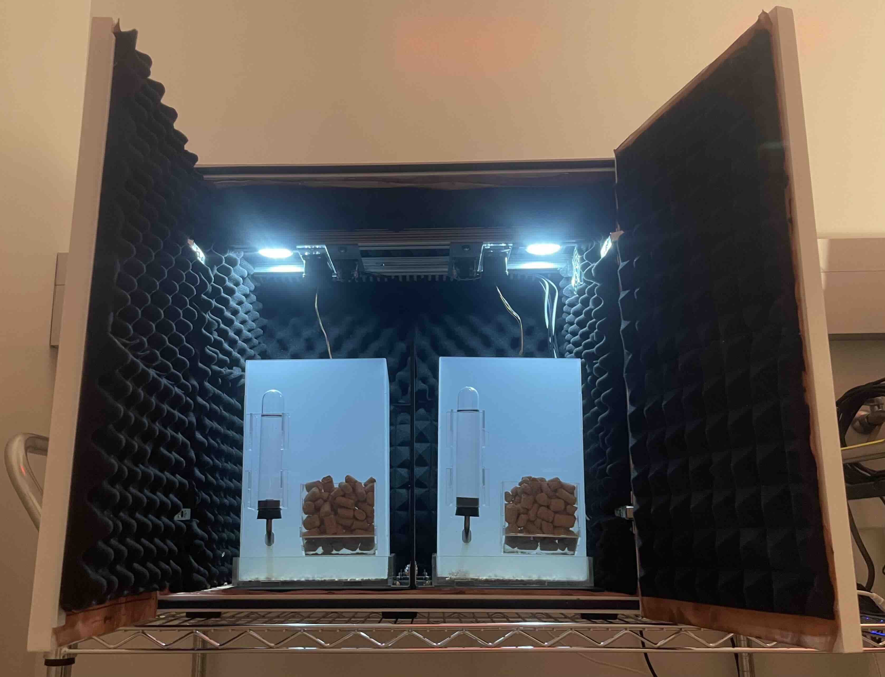

# This repository contains hardware and software requirements for running continuous EEG/EMG recordings in mice.

We are developing a EEG/EMG setup to investigate the sleep profile and seizure
incidence in mice using Pinnacle Technology's [Sirenia® software
packages](https://www.pinnaclet.com/sirenia.html).

The mouse EEG/EMG recordings take place inside modified Med Associates
sound-attenuating cubicles that are outfitted with
Faraday-shielding copper mesh and sound-proof acoustic foam panels. The
mice undergoing recordings are individually housed inside custom-cut acrylic cages.
Circadian lighting is achieved using LED & IR lights that are powered via
24-hour programmable outlet timers. Overhead cameras are used to record video of
mouse behavior in tandem with EEG/EMG recordings. EEG/EMG signals are recorded
using Pinnacle's EEG/EMG tethered mouse system and headmounts.

 
**Figure 1.** _Prototype of modified cubicle used for EEG/EMG recordings._

### Table of contents

| **Section** | **Description** |
|:-|:-|
| [Hardware](#hardware) | Hardware specifications and set up tutorial |
| [Future directions](#future-directions) | Planned updates to the project |

## Hardware

For a detailed hardware setup tutorial, please click [here](./Hardware/).

### Hardware specifications

1. Pinnacle Data Conditioning and Acquisition System
   ([8401](https://store.pinnaclet.com/products/8401-hr-4-channel-data-conditioning-and-acquisition)
   &
   [8206](https://store.pinnaclet.com/products/8206-data-conditioning-and-acquisition-system)
   models)
2. Pinnacle EEG/EMG headmounts ([Model 8201-SS](https://store.pinnaclet.com/products/8201-2-eeg-1-emg-mouse-headmount?variant=12390701727847))
3. [Med Associates Sound Attenuating
   Cubicle](https://med-associates.com/product/sound-attenuating-cubicles-mdf/)
4. T-slotted aluminum extrusion profile framing
5. Camera(s)
6. [Acrylic sheets](https://canalplastics.com/)
7. [Copper mesh (0.0045" diameter)](https://www.twpinc.com/100-mesh-copper-0045-wire-dia)
8. [Acoustic foam panels](https://www.amazon.com/Self-Adhesive-Quick-Recovery-Elasticity-Eco-Friendly-WVOVW/dp/B0BLTSW8KC)
9. [Dimmable LED Lights](https://www.amazon.com/JUSJUBR-Lighting-Dimmable-Function-Bookshelf/dp/B0CCDPNYFG)
10. IR lights
11. [24-hour programmable outlet timer](https://www.amazon.com/Fosmon-Programmable-Seasonal-Portable-Aquarium/dp/B07HCQKRRY)
12. Desktop/laptop

### Work in Progress

1. Extending the pre-amplifier cable from the overhead commutator to the cage floor
2. Optimizing lighting and video-recording settings
3. Finalizing design of EEG/EMG box accessories
3. Developing a software protocol

## Future directions

1. Developing a custom analysis code

-----

Contact: [Gergely Turi](mailto:gt2253@cumc.columbia.edu)